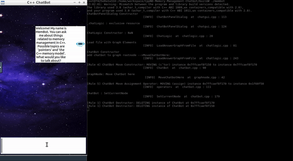

# ChatBot

## Intro
The ChatBot creates a dialogue where users can ask questions about some aspects of memory management in C++. After the knowledge base of the chatbot has been loaded from a text file, a knowledge graph representation is created in computer memory, where chatbot answers represent the graph nodes and user queries represent the graph edges. After a user query has been sent to the chatbot, the Levenshtein distance is used to identify the most probable answer. This project uses raw pointers to represent the knowledge graph and interconnections between objects.

### Basic Build Instructions
1. Clone this repo.
2. Make a build directory in the top level directory: `mkdir build && cd build`
3. Compile: `cmake .. && make`
4. Run it: `./membot`.


### Code structure
```
src -
    | `chatgui.h` / `chatgui.cpp`
    | `chatlogic.h` / `chatlogic.cpp` 
    | `chatbot.h` / `chatbot.cpp`
    | `graphnodes.h` / `graphnodes.cpp`
    | `graphedges.h` / `graphedges.cpp`
```
* `chatgui.h` / `chatgui.cpp`:  In file `chatgui.h` / `chatgui.cpp`, this makes `_chatLogic` an exclusive resource to class `ChatbotPanelDialog` using a smart pointer.
* `chatbot.h` / `chatbot.cpp`:  `ChatBot` complies with the Rule of Five such as Chatbot constructor methods which allocate / deallocate memory resources on the heap and also copy member data. When sending a query to the ChatBot, it prints a string of the type e.g. "ChatBot Copy Constructor" to the console. Rule of five mehtods are as follows:
    * ChatBot Constructor/Destructor
    * ChatBot Move Constructor
    * ChatBot Move Assignment Operator
    * ChatBot Copy Constructor 
    * ChatBot Copy Assignment Operator
* `chatlogic.h` / `chatlogic.cpp`: 
    * adapt the vector `_nodes` in a way that the instances of `GraphNodes` to which the vector elements refer are exclusively owned by the class `ChatLogic`. 
    * create a local `ChatBot` instance on the stack at the bottom of function `LoadAnswerGraphFromFile`. 
    * pass the `ChatBot` instance into the root node by using move semantics. 
    * `ChatLogic` has no ownership relation to the `ChatBot` instance and thus is no longer responsible for memory allocation and deallocation
    * the `ChatBot` instance (`_chatBot`) is used as a communication handle between GUI and `ChatBot` instance. 
    * When passing the `GraphNode` instances to functions, contains the changes to class `ChatLogic`. 

* `graphnodes.h` / `graphnodes.cpp`
    * each instance of `GraphNode` exclusively owns the outgoing `GraphEdges` and holds non-owning references to incoming `GraphEdges` with smart pointers.
    * When transferring ownership from class `ChatLogic`, where all instances of `GraphEdge` are created, into instances of `GraphNode`, use move semantics. 

### demo 


### Run-time Environment Dependency
* cmake >= 3.11
* make >= 4.1
* gcc/g++ >= 5.4
* [wxWidgets](https://wiki.wxwidgets.org/Install) >= 3.0, [wxWidgets Binary](https://wiki.codelite.org/pmwiki.php/Main/WxWidgets30Binaries#toc2)
